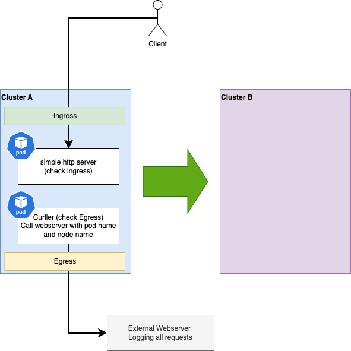

# Cluster-to-Cluster Ingress and Egress Migration



## Prepare both clusters

* Label nods with label `k8s.ovn.org/egress-assignable=`
  ```
  oc label node -l node-role.kubernetes.io/worker \
    k8s.ovn.org/egress-assignable=
  ```
* Install and start MetalLB via OperatorHub
	Apply generic L2
	```
	oc apply -f - <<EOF
	apiVersion: metallb.io/v1beta1
	kind: L2Advertisement
	metadata:
		name: l2advertisement
		namespace: metallb-system
	spec:
		ipAddressPoolSelectors:
			- matchExpressions:
					- key: pub.openshift.examples/tenant
						operator: Exists
	EOF
	```

## Cluster ocp1

### Deploy

```shell 
$ oc apply -k .
namespace/ingress-egress-demo-workload created
service/simple-http-server created
service/router-external-alpha created
deployment.apps/curller created
deployment.apps/simple-http-server created
egressip.k8s.ovn.org/egress-coe configured
ipaddresspool.metallb.io/alpha created
ingresscontroller.operator.openshift.io/alpha created
route.route.openshift.io/simple-http-server created
```

### Check Application

```shell
$ curl http://simple-http-server.alpha.coe.muc.redhat.com

<!DOCTYPE html>
<html>
<body>
<h3>Hi,</h3>
I'm a simple socat+bash webserver running in
pod <strong>simple-http-server-76657bb998-m7cn2</strong> on node <strong>ocp1-worker-0</strong>
</body>
</html>
```

Webserver log from curller requests
```shell 
10.130.0.2 - - [08/May/2025:19:56:56 +0000] "GET /curller-b4749f775-2v2cb/ocp1-worker-0 HTTP/1.1" 404 153 "-" "curl/7.76.1" "10.32.105.73"
```


### Destroy

```shell
oc delete --wait-false -k .

```

## Cluster ocp7

### Deploy

```
$ oc apply -k .
namespace/ingress-egress-demo-workload created
service/simple-http-server created
service/router-external-alpha created
deployment.apps/curller created
deployment.apps/simple-http-server created
egressip.k8s.ovn.org/egress-coe configured
ipaddresspool.metallb.io/alpha created
ingresscontroller.operator.openshift.io/alpha created
route.route.openshift.io/simple-http-server created
```

### Check

```shell

curl http://simple-http-server.alpha.coe.muc.redhat.com

<!DOCTYPE html>
<html>
<body>
<h3>Hi, 10.128.3.99</h3>
I'm a simple socat+bash webserver running in
pod <strong>simple-http-server-86cb4b688d-ksllg</strong> on node <strong>ocp7-worker-2</strong>
</body>
</html>
```

Webserver log from curller requests
```shell
10.130.0.2 - - [08/May/2025:20:02:46 +0000] "GET /curller-7879f9bbdf-nqhsr/ocp7-worker-2 HTTP/1.1" 404 153 "-" "curl/7.76.1" "10.32.105.72"
10.130.0.2 - - [08/May/2025:20:02:51 +0000] "GET /curller-7879f9bbdf-nqhsr/ocp7-worker-2 HTTP/1.1" 404 153 "-" "curl/7.76.1" "10.32.105.73"
```

